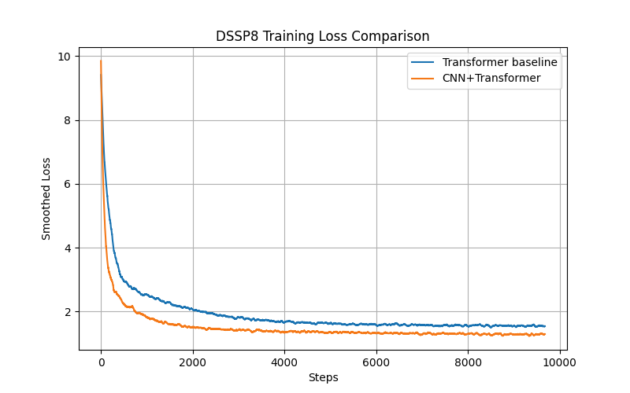
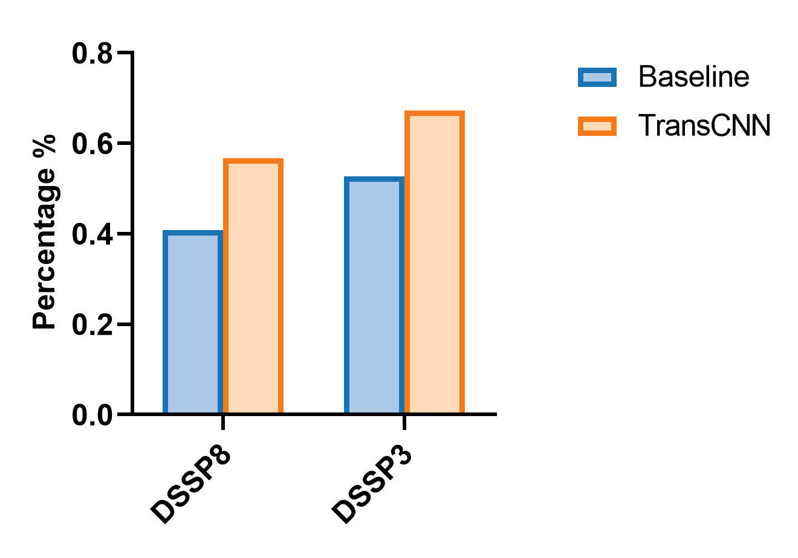

# SecTransCNN
## Abstract
蛋白质二级结构是连接氨基酸一级序列与三维空间结构的重要中间层级，既反映了蛋白质的局部构象特征，也为更高层次的结构预测提供有效约束。因此，二级结构预测长期以来一直是蛋白质结构预测中的核心问题之一。蛋白质二级结构的形成同时受到远端残基间的长程相互作用以及局部序列环境（如邻近残基的理化性质与空间限制）的共同影响。基于这一特点，本文尝试在 Transformer 架构中引入卷积层：利用自注意力机制建模全局范围内的长距离依赖关系，同时通过卷积操作强化模型对局部序列模式的建模能力。实验结果表明，相较于仅使用 Transformer 的基线模型，引入卷积层后模型在二级结构预测任务上的准确率有明显提升。但整体性能仍存在较大提升空间。本文在讨论部分进一步分析了可能的限制因素，并提出了后续的改进方向。

## Background
Transformer 架构最初被提出用于序列到序列（Seq2Seq）任务，其核心思想是通过自注意力机制显式建模序列中任意两个 Token 之间的依赖关系。这一设计弱化了序列位置带来的限制，有效缓解了传统 RNN 和 LSTM 在长序列建模中常见的长期依赖难以捕获以及梯度消失或爆炸等问题。卷积神经网络（CNN）则以其局部感受野和参数共享的特点，擅长从局部上下文中提取稳定的模式信息，广泛应用于计算机视觉和医学影像分析等任务。在序列建模场景中，卷积层同样能够有效捕捉相邻元素之间的局部关联。
蛋白质是由约 20 种标准氨基酸按特定顺序连接形成的线性高分子，其序列组合空间极其庞大。蛋白质二级结构通常依据 DSSP（Define Secondary Structure of Proteins）算法进行标注，该算法基于蛋白质三维结构坐标，通过几何与能量判据识别主链之间的氢键网络，从而推断局部构象特征。基于氢键的局部构型，DSSP 将残基划分为八类二级结构状态（DSSP8），并在实际建模任务中通常进一步归并为三类（DSSP3）：螺旋（H）、β 链（E）和环区（C）。蛋白质中氨基酸的线性排列顺序被称为一级结构（即一维序列表示）。
在蛋白质二级结构预测任务中，氨基酸序列既表现出明显的长距离依赖特性，又强烈依赖于局部残基所形成的微环境，例如局部极性分布、空间位阻以及二级结构片段的连续性等因素。单纯依赖 Transformer 的全局注意力机制，可能会削弱模型对这些局部结构信号的敏感性，从而限制预测性能。基于上述考虑，本项目尝试将 Transformer 与卷积层相结合：首先利用 Transformer 建模序列范围内的全局相互作用，再通过卷积操作对局部序列特征进行进一步建模，以期在全局信息与局部信息之间取得更好的平衡。

## Result

首先，输入序列被送入 Transformer 编码器，用于建模序列中残基之间的全局相互作用，特别是潜在的长距离依赖关系。然而，蛋白质二级结构的形成不仅依赖远端相互作用，也强烈受到局部残基微环境的影响。为增强模型对局部结构模式的感知能力，我们在 Transformer 输出后引入卷积层，对局部连续残基片段进行进一步建模。最终，融合后的特征通过线性层，用于逐位预测每个残基的二级结构类型。

从训练损失曲线可以观察到，融合卷积后的模型在早期收敛阶段呈现出更稳定的下降趋势，并在大部分训练过程中维持较低的损失值。这一现象提示，卷积层所引入的局部结构约束可能减少了参数搜索空间中的不确定性并改善了收敛稳定性。
从测试集的准确率结果来看，融合卷积后的模型整体表现优于基准模型。这表明局部残基环境信息的引入有助于模型学习与二级结构形成相关的结构模式。然而，这一提升也可能部分来源于参数量增加所带来的表征能力增强。
综合 DSSP8 与 DSSP3 的实验结果可以看到，无论在训练损失还是测试准确率上，模型在 DSSP3 数据集上的表现均优于 DSSP8。这一结果说明，模型目前仅学习到部分与二级结构形成相关的高层次模式，而对更精细的结构差异与局部约束的刻画仍显不足。

##Discussion
本研究结果表明，将卷积结构引入 Transformer 框架有助于提升蛋白质二级结构预测的性能，但整体准确率仍然较低。造成这一现象的原因可能包括以下几个方面。
首先，模型规模相对较小，隐藏维度不足以及参数总量有限，限制了模型表达能力，无法充分刻画二级结构形成所依赖的复杂语义与结构特征。其次，模型仅使用一级氨基酸序列作为输入，没有显式引入进化信息、三维结构信息或环境上下文信息，这在一定程度上削弱了其对真实生物过程中结构形成机制的建模能力。
基于上述不足，未来工作可以从数据与模型结构两个方向展开改进。在数据层面，可以引入多序列比对（MSA）或蛋白语言模型生成的进化特征（如PSSM、PASS），体现选择压力和进化保守性信息；同时，可进一步融合结构层面的特征，例如主链扭转角、局部极性环境，从而为模型提供更贴近现实的约束。此外，通过可视化注意力权重，可以分析模型是否关注到α螺旋、turn、loop 等典型结构相关的残基模式，从而为模型设计提供反馈。
在模型层面，可以尝试引入膨胀卷积（dilated convolution），使模型能够同时捕捉长程残基相互作用与局部微环境特征。归一化方式也可以从传统 LayerNorm 拓展至Derf（个人感觉这种光滑的曲线用来进行均一化更符合生物学特征？）。最后，在损失函数设计上，可以引入标签平滑（label smoothing），以抑制模型产生过度自信的预测。二级结构类别之间在理化性质与构象特征上部分存在相似性，标签平滑在一定程度上能够反映这种连续性，从而有望提升模型的泛化能力。
总体来看，现有模型已经在宏观结构层面学习到一定规律，但在模型结构和数据特征上仍存在改进空间。后续通过扩大参数容量、引入进化与结构信息、引入新的模型结构，有望进一步提升预测精度。
准确性不够的原因可能是因为scaling问题，数据量太小以及隐藏层的d_model不够大，导致它并没有表达出足够多的语义空间从而进行学习
